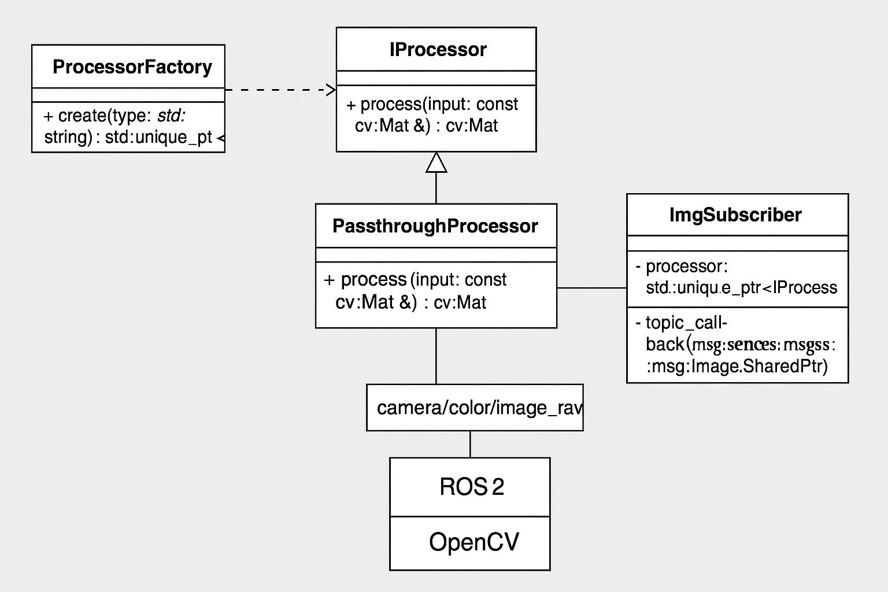

# cpp_arch

# image_processor_package

ROS2上で画像処理を行うC++ノードの実装を通して、C++のソフトウェア設計を体系的に学習するためのリポジトリ。 
アルゴリズム実装だけでなく、**依存分離・抽象化・柔軟な設計構造の構築**にフォーカス。

---

## 目的

C++による画像処理アプリケーションを通して、以下のような設計力を身につける：

- ソフトウェア設計原則（OOP, SRP, OCPなど）の実践
- インターフェースによる依存抽象化
- 拡張性を意識した責務分離構成
- C++固有のスマートポインタ・所有権管理
- 各種デザインパターンの習得と適用

---

## 構成概要

- `IProcessor`：画像処理の抽象インターフェース（純粋仮想）
- `PassthroughProcessor`：何もしない処理（基本の実装例）
- `ImgSubscriber`：ROS2ノードとしてImageトピックを購読し、処理器を通して表示
- `ProcessorFactory`：文字列指定でProcessorの具体型を生成
- `main.cpp`：FactoryからProcessorを生成し、ノードに注入して実行

---

## 実装済みの設計パターン・原則

| 設計要素               | 状態     | 内容                                           |
|------------------------|----------|------------------------------------------------|
| **Strategyパターン**     | ✅        | `IProcessor`により処理の戦略を切替可能         |
| **Factoryパターン**      | ✅        | 文字列から処理クラスを生成                    |
| **Dependency Injection**| ✅        | `main.cpp`からノードに処理器を注入             |
| **OCP（開放/閉鎖原則）** 　| ✅        | 新しいProcessor追加時、既存コードを変更不要     |
| **ユニーク所有権管理**   　| ✅        | `unique_ptr<IProcessor>`で責任を明確化         |

---

## 今後の拡張予定（設計力強化）

- [ ] MockProcessor導入とGoogleTestでの単体テスト
- [ ] 実装/抽象の独立化（Bridgeパターン）
- [ ] Type Erasureを使った汎用処理器（型抹消構成）
- [ ] External Polymorphismの導入

---

## 使用技術

- ROS2 (Jazzy)
- C++17
- OpenCV
- `cv_bridge`
- `ament_cmake`

---
